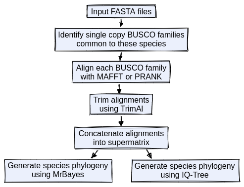

# BuscoPhylo

Pipeline to construct species phylogenies using BUSCOs.



The pipeline automatically creates the directory structure from the config file. Default directory structure:

```
|-results
    |- busco
    |- ids
    |   |- common_ids
    |   |- single_copy_busco_sequences.common.dir
    |   |- merged_sequences  
    |- alignment
    |   |- mafft
    |   |- trimal
    |- concat_alignments
    |- phylogeny
    |   |- iqtree
    |   |- mrbayes
```

### Usage example

```
snakemake --snakefile workflow/Snakemake --profile profile/slurm/ --configfile config/default.yaml \
    --config genome_dir=""  busco_path="" busco_dataset_path="" \
    mafft_path="" trimal_path="" iqtree_path="" mrbayes_path="" \
    --printshellcmds --latency-wait 60
```

### Requirements
* [Snakemake](https://snakemake.github.io/)
* [BUSCO v3](https://busco-archive.ezlab.org/)
* [MAFFT](https://mafft.cbrc.jp/alignment/software/)
* [TrimAl](http://trimal.cgenomics.org/)
* [IQ-TREE](http://www.iqtree.org/)
* [MrBayes](https://nbisweden.github.io/MrBayes/index.html)


`BUSCO`, `MAFFT`, `TrimAl`, `IQ-TREE` and `MrBayes` paths should be in config file or specified at startup.
